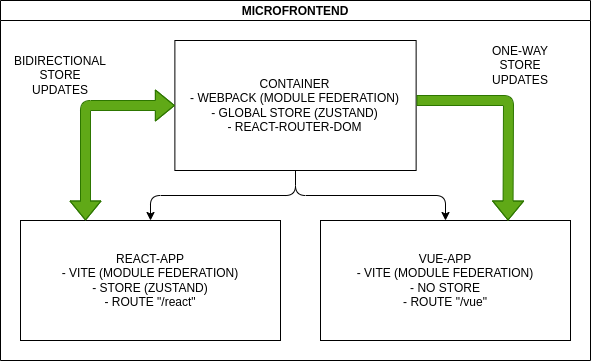

# Microfrontend - Shared Router

## Introduction

This repository contains a microfrontend project that demonstrates the usage of a shared router in a container application made with React and two independent applications made with React and Vue respectively. The container application utilizes webpack module federation, while the individual applications are built with Vite and the module federation plugin ([vite-plugin-federation](https://github.com/originjs/vite-plugin-federation)).

The container manages the routing of the microfrontend, using react-router-dom for navigation and Zustand for state management of the global store. The React application is rendered at "/react" path, while the Vue application is rendered at "/vue" path. The React app receives state updates from the container and can modify the shared state, while the Vue app only receives the state from the container to display the results.



## Development

To start the development environment, follow these steps:

1. Navigate to the "container" folder and run the command `npm run dev`.
2. Navigate to the "react-app" folder and run the command `npm run preview`.
3. Navigate to the "vue-app" folder and run the command `npm run preview`.

When working as a microfrontend, any changes made in the applications require rebuilding the "react-app" or "vue-app". To restart an application, stop it and then execute the command `npm run restart`. However, the container app can be restarted simply by running `npm run dev`.

If you are working on a standalone application, it is recommended to use the command `npm run dev` for all applications.

## Build

To build the project, follow these steps:

1. Navigate to the "container" folder and run the command `npm run build`.
2. Navigate to the "react-app" folder and run the command `npm run build`.
3. Navigate to the "vue-app" folder and run the command `npm run build`.

## Project Structure

The project follows the following structure:

```txt
- container
  - ... (container-specific files)

- react-app
  - ... (React app-specific files)

- vue-app
  - ... (Vue app-specific files)
```

## About the Project

The main purpose of this project is to showcase the concept of microfrontends with a shared router. The container application, built with React and webpack module federation, serves as the entry point for the microfrontend architecture. It manages the routing of the applications and utilizes react-router-dom for navigation and Zustand for state management.

The React application is rendered at the "/react" path, while the Vue application is rendered at the "/vue" path. The React app receives state updates from the container and can modify the shared state. On the other hand, the Vue app only receives the state from the container to display the results.

Feel free to explore the code and make any necessary modifications to suit your requirements.

Please note that this project may require additional setup and configuration steps depending on your development environment.
