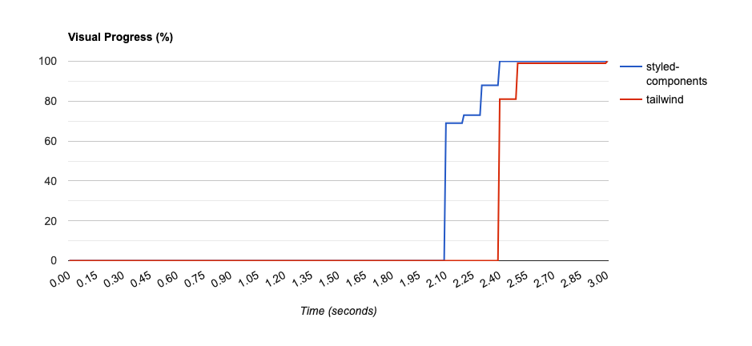

# Comparative Analysis between styled-components and Tailwind CSS 🎨

In this article, we present a comparative analysis of styled-components and Tailwind CSS, focusing on practical implementations in the [Fylo dark theme landing page](https://www.frontendmentor.io/challenges/fylo-dark-theme-landing-page-5ca5f2d21e82137ec91a50fd) FrontendMentor challenge. The goal is to discuss the first impressions of both approaches, their advantages and disadvantages, and compare the development experience.

## Projects Setup 🖥️🛠️

This analysis was conducted as part of the frontend practice at Nanlabs. Two team members completed the challenge using different approaches:

- `styled-components` project
  - Created with the **[create-awesome-node-app](https://www.npmjs.com/package/create-awesome-node-app)** package.
  - Built with React.
  - Repository: <https://github.com/nati08/challenge_estilos>

- `tailwind` project
  - Created with the **[create-awesome-node-app](https://www.npmjs.com/package/create-awesome-node-app)** package.
  - Built with React.
  - Repository: <https://github.com/Juanma-NaN/frontend-challenge>
  - 🟢 Small images, such as avatar images, were included directly in the JavaScript bundle.

## PageSpeed Insights 🧪

After completing and deploying both projects, we tested them using [PageSpeed Insights](https://pagespeed.web.dev/) (lighthouse) to evaluate their performance. Here are the results 🎉🚀📊

> ⚙️ Comparisons were performed using the following environment settings:  
> Emulated Desktop with Lighthouse 10.3.0  
> User agent (network): "Mozilla/5.0 (Macintosh; Intel Mac OS X 10_15_7) AppleWebKit/537.36 (KHTML, like Gecko) Chrome/109.0.0.0 Safari/537.36”  
> Network throttling: 40 ms TCP RTT, 10,240 kb/s throughput (Simulated)  
> Browser location: North America

### Styled-components 💅

The metrics for the styled-components project were generally good, except for "Cumulative Layout Shift" (CLS). This shift occurs because layout movement happens when images finish loading, altering the distribution of elements as the space required for the images is not reserved while waiting for them to load.

Below is a list of all the images that impact the CLS.

### Tailwind CSS 🧩

In the case of Tailwind CSS, the results were similar, but the "Cumulative Layout Shift" was lower compared to the styled-components project. This is not due to a specific advantage of Tailwind CSS but because there are fewer images causing the layout shift. The avatar images are included directly in the JavaScript bundle as base64, ensuring they are already loaded in the first render. Below are the CLS results for the Tailwind CSS project.

Next, we present a list of all the images that impact the CLS in the Tailwind CSS project. You can compare this list with the one from the styled-components project.

### Conclusions about PageSpeed Insights

In this comparison, apart from the CLS metric, we didn't find any significant difference between the two approaches. For this simple example, which applies to static landing pages in general, both approaches yield good results based on the defined metrics.

💡 Let's remember that Cumulative Layout Shift (CLS) is a web performance metric that measures the visual stability of a page during its loading. Being a performance metric and part of the "Core Web Vitals," it is important in the context of SEO. These metrics are a set of metrics that search engines use to evaluate the quality of the user experience on a page, and having good results in them helps to achieve better positioning and relevance in search engine results.

## Comparison with Webpagetest ⚔️ [Webpagetest](https://www.webpagetest.org/)

We used [Webpagetest](https://www.webpagetest.org/) to compare the performance of both projects. This tool allows us to test the performance of a website from different locations and devices. In this case, we tested both solutions on this platform with the following environment setup:  

- Chrome on an Emulated Motorola G (gen 4) tested from Virginia, US
- 9 Mbps 4G connection with 170ms of latency.

In this comparison, we made interesting findings related to the approach used and the image strategy employed.

Regarding the image strategy, it's important to note that the Tailwind solution includes avatar images directly in the JavaScript bundle, utilizing a different approach than styled-components. In the following two images 🌌, we can see that the Tailwind solution has less CLS compared to the styled-components solution but takes longer to generate visual progress in the first render. This difference is due to the larger initial Tailwind chunk, which includes the user avatars.

🔄 On the other hand, the styled-components solution generates faster visual progress but causes more CLS due to the asynchronous loading of images. 🚀

🧐 It's important to note that the time difference is minimal when viewed in seconds, and we cannot definitively say that one strategy is superior to the other in this comparison, as both fall within the same range of the FCP metric 📊 (Orange: 1.8s–3s). However, this example demonstrates how strategies to reduce CLS can impact other metrics like FCP.

📊 Now, let's compare the number of requests and the size in bytes of both solutions to draw some conclusions. Regarding the number of requests, we can observe that both developments have the same quantity, except for images, which aligns with our observations throughout the entire comparison.

However, there is a noticeable difference in the size of the responses. In the case of styled-components, the responses are larger in terms of the number of bytes in both the JavaScript and CSS files. This can be attributed to the fact that styled-components, being a CSS-in-JS solution, includes styles within JavaScript files. Additionally, the JavaScript bundle includes the dependency on the styled-components package. 📦

On the other hand, in the Tailwind CSS solution, we only find CSS files, as the Tailwind dependency is included as a development dependency. 🎨

## Development Experience 💻🚀

### Styled-components 💅

Unlike working with separate CSS files, styled-components allows styles to be directly implemented for individual components. This promotes reusability and easy maintenance, as the styles are closely tied to the components they belong to. 🤝

Mixing CSS and JavaScript: By writing styles directly in JavaScript using string interpolation, JavaScript syntax can be combined with CSS (”JS-CSS Blend 🤔”). This allows leveraging all the capabilities of the language, such as variables, functions, and operators, enabling the creation of dynamic styles based on component states. 🎨🧩

With styled-components, there is no need to worry about defining class names, as developers work directly with React component names. Internally, styled-components handles the mapping between the component name and how the HTML tag would look, along with the CSS class definition, automatically generating unique class names for each component. 🔗🧩

It has a relatively low learning curve since developers write CSS but need to get accustomed

 to managing states through JavaScript props. 📈🔄

## Tailwind CSS 🧩

Tailwind CSS follows a "utility-first" approach, where styles are represented by utility classes applied directly in the HTML. Instead of creating components with specific styles, developers define reusable styles through the composition of pre-defined utility classes to create new and specific components/layouts. 🔧

Tailwind CSS offers a wide range of utility classes covering various styles and properties. This provides great flexibility and allows rapid building of custom layouts without writing custom CSS. However, it requires a higher learning curve as developers need to familiarize themselves with the syntax and naming conventions of these classes. Once this learning curve is overcome, Tailwind CSS becomes an excellent choice for rapid prototyping. 🏃🚀

When using multiple utility classes, it's essential to maintain a clear and consistent naming convention to avoid maintenance and readability issues.

In summary, Tailwind CSS's utility classes effectively implement the concept of design tokens at the CSS level.

### Comparison between styled-components and Tailwind CSS 💅🧩

The project implemented with Tailwind has a smaller bundle size 📦 since it doesn't include JavaScript code for generating styles and only adds the definition of classes used throughout the application. Consequently, even though both libraries reduce code size by eliminating unused styles during compilation, Tailwind contributes to a lighter bundle.

💡 Tailwind has a steeper learning curve compared to styled-components, as it requires understanding and learning 📚 the definition of classes (tokens) to work efficiently. However, for creating landing pages or prototypes, Tailwind remains a better solution as it eliminates the need to define all CSS classes.

📝✨ Styled-components provide better code readability than Tailwind, mainly because, in the case of Tailwind, developers must first become familiar with the pre-defined classes.

For larger projects, styled-components may be a more suitable choice as it allows style definition at the component level, promoting code reusability. In contrast, applying styles directly to HTML tags in Tailwind may make code reading and maintenance more challenging, although it's worth mentioning that there are solutions for this issue in Tailwind, but we are referring to its more purist usage approach. 👨‍💻

## Conclusion 📝

In conclusion, styled-components and Tailwind CSS are two different approaches to managing styles in web applications. Styled-components focus on components, enabling styles at the component level, while Tailwind CSS relies on utility classes applied directly in HTML. The choice between them will depend on the team's preferences and your project's structure. 🤔👨‍💻 Styled-components may be more suitable if you prefer encapsulated styles at the component level and want to leverage the flexibility of JavaScript. 🔄 On the other hand, Tailwind CSS can be a quicker and easier option if you seek a wide range of reusable styles and don't wish to write custom CSS.
