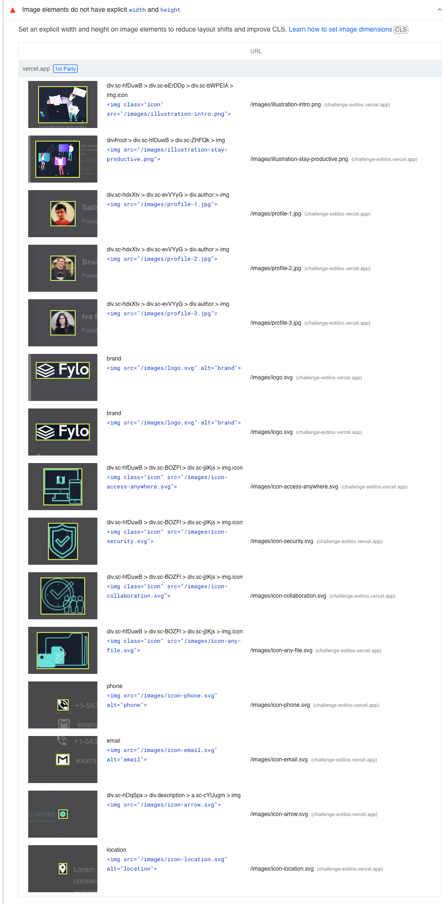

# 🎨 Styles challenge

💻📊 The idea of this practical comparison was to implement the frontendmentor challenge called “[Fylo dark theme landing page](https://www.frontendmentor.io/challenges/fylo-dark-theme-landing-page-5ca5f2d21e82137ec91a50fd)” in two different projects using styled-components and Tailwind CSS in order to see first impressions of both approaches and discuss what advantages/disadvantages they have. , see how they impact the resulting build and compare the development experience.

## 🖥️🛠️ Projects setup

🔧 We worked on this initiative as part of the frontend practice at Nanlabs. Two members of this group carried out the challenge's developments, where each of them implemented a solution using one of the approaches. 🛠️ Below is an overview of how the setups were done.

- styled-components project
    - Project generated by the **[create-node-app](https://github.com/Create-Node-App/create-node-app)** package
    - Project in React
    - Repo: https://github.com/nati08/challenge_estilos
- tailwind project
    - Project generated by the **[create-node-app](https://github.com/Create-Node-App/create-node-app)** package
    - Project in React
    - Repo: https://github.com/Juanma-NaN/frontend-challenge
    - 🟢 Small images, such as avatar images, were included directly in the javascript bundle.

## 🧪 [PageSpeed Insights](https://pagespeed.web.dev/)

Once finished and deployed both developments, we did a simple test using pageSpeed (lighthouse) for both projects where the results we observed were the following 🎉🚀📊

> ⚙️ Comparisons were performed using the following environment settings: 
Emulated Desktop with Lighthouse 10.3.0
User agent (network): "Mozilla/5.0 (Macintosh; Intel Mac OS X 10_15_7) AppleWebKit/537.36 (KHTML, like Gecko) Chrome/109.0.0.0 Safari/537.36”
Network throttling: 40 ms TCP RTT, 10,240 kb/s throughput (Simulated)
Browser location: North America
> 

### Styled-components  **💅**

We were able to observe that all the metrics are good except for "Cumulative Layout Shift", which is due to the fact that layout movement occurs when the images finish loading and they modify the distribution of the elements since we do not reserve the space required by these images while we wait for them to finish loading.

Next we leave a list of all the images that impact the CLS.

### Tailwind CSS **🧩**

In the case of Tailwind CSS, the result was the same, except that the "Cumulative Layout Shift" was lower than in the previous case. This is not due to a specific advantage of Tailwind CSS over styled-components but rather because there are fewer images causing this layout shift. The avatar images are included directly in the JavaScript bundle as base64, so they are already loaded in the first render. Below are the results of the CLS that came out in the analysis.

.png)

Next we leave a list of all the images that impact the CLS. You can compare this list with the list of styled-component

.png)

### Conclusions about [PageSpeed Insights](https://pagespeed.web.dev/)

In this comparison, apart from the CLS metric, we didn't find any significant difference between the two approaches. For this simple example, where we can generalize for static landing pages, both approaches yield good results based on the defined metrics.

## ⚔️ Comparison with [webpagetest](https://www.webpagetest.org/)

> ⚙️ Comparing both solutions on this platform with the following environment setup: 
Chrome on an Emulated Motorola G (gen 4) tested from Virginia, US on a 9 Mbps 4G connection with 170ms of latency.
> 

🔍 In this comparison, we found some interesting findings, where some of them can be related to the approach used, and others are related to the image strategy they used.

Starting with the image strategy, let's remember that in the solution of Tailwind, the images representing user avatars are included within the JavaScript bundle due to the image import strategy used for these cases. In the following two images 🌌, we can see that the Tailwind solution has less CLS compared to the styled-components solution but takes longer to generate visual progress in the first render. This is because the initial Tailwind chunk is larger than the initial styled-components chunk, as the initial Tailwind chunk includes user avatars.

🔄 On the other hand, the styled-components solution generates faster visual progress but, due to the asynchronous loading of images, it causes more CLS. 🚀

🧐 Let's keep in mind that the time difference is low when looked at in seconds, and we cannot say that one strategy is better than the other in this comparison because, for this test, they fall within the same range of the FCP metric 📊 (Orange: 1.8s–3s). However, it is a good example to understand how this type of strategy to reduce CLS impacts the time of other metrics such as FCP. 

📊 Now, let's compare the number of requests and the size in bytes of both solutions to draw some conclusions. Regarding the number of requests, we can see that both developments have the same quantity, except for images, which aligns with our observations throughout the entire comparison. 

However, there is a noticeable difference in the size of the responses. In the case of styled-components, the responses are larger in terms of the number of bytes in both the JavaScript and CSS files. This can be attributed to the fact that styled-components, being a CSS-in-JS solution, includes styles within JavaScript files. Additionally, the JavaScript bundle includes the dependency on the styled-components package. 📦

On the other hand, in the Tailwind CSS solution, we only find CSS files, as the Tailwind dependency is included as a development dependency. 🎨

## **Development Experience 💻🚀**

### **styled-components 💅**

Unlike working with CSS files, styled-components implement styles directly for individual components instead of separated or global CSS files. This promotes reusability and easy maintenance as the styles are closely coupled with the components they belong to. 🤝

Mixing CSS and JavaScript: By writing styles directly in JavaScript using string interpolation, we can mix JavaScript syntax with CSS (”JS-CSS Blend 🤔”). This allows us to leverage all the capabilities of the language, such as variables, functions, and operators, enabling the creation of dynamic styles based on component states. 🎨🧩

With styled-components, we don't have to worry about defining class names, as we work directly with React component names. Internally, styled-components handles the mapping between the component name and how the HTML tag would look along with the CSS class definition, automatically generating unique class names for each component. 🔗🧩

It has a relatively low learning curve since we write CSS, but we need to get accustomed to managing states through JavaScript props. 📈🔄

## **Tailwind CSS 🧩**

Tailwind CSS follows a "utility-first" approach, where styles are represented by utility classes applied directly in the HTML. Instead of creating components with specific styles, we define reusable styles through the composition of pre-defined utility classes to create new and specific components/layouts. 🔧

Tailwind CSS offers a wide range of utility classes covering various styles and properties. This provides great flexibility and allows us to quickly build custom layouts without writing custom CSS. However, it requires a higher learning curve as we need to familiarize ourselves with the syntax and naming conventions of these classes. Once we overcome this learning curve, Tailwind CSS becomes an excellent choice for rapid prototyping. 🏃🚀

When using multiple utility classes, it's essential to maintain a clear and consistent naming convention to avoid maintenance and readability issues. 

In summary, Tailwind CSS's utility classes effectively implement the concept of design tokens at the CSS level. 

### **Comparison between styled-components and Tailwind CSS 💅🧩**

The project implemented with Tailwind has a smaller bundle size 📦 since it doesn't include JavaScript code for generating styles and only adds the definition of classes used throughout the application. Consequently, even though both libraries reduce code size by eliminating unused styles during compilation, Tailwind contributes to a lighter bundle. 

💡 Tailwind has a steeper learning curve compared to styled-components, as it requires understanding and learning 📚 the definition of classes (tokens) to work efficiently. However, for creating landing pages or prototypes, Tailwind remains a better solution as it eliminates the need to define all CSS classes.

📝✨Styled-components provide better code readability than Tailwind, mainly because in the case of Tailwind, you must first become familiar with the pre-defined classes. 

For larger projects, styled-components may be a more suitable choice as it allows style definition at the component level, promoting code reusability. In contrast, applying styles directly to HTML tags in Tailwind may make code reading and maintenance more challenging, although it's worth mentioning that there are solutions for this issue in Tailwind, but we are referring to its more purist usage approach. 👨‍💻

📝 Summary:

In conclusion, styled-components and Tailwind CSS are two different approaches to managing styles in web applications. Styled-components focus on components, enabling styles at the component level, while Tailwind CSS relies on utility classes applied directly in HTML. The choice between them will depend on the team's preferences and your project's structure. 🤔👨‍💻 Styled-components may be more suitable if you prefer encapsulated styles at the component level and want to leverage the flexibility of JavaScript. 🔄 On the other hand, Tailwind CSS can be a quicker and easier option if you seek a wide range of reusable styles and don't wish to write custom CSS.